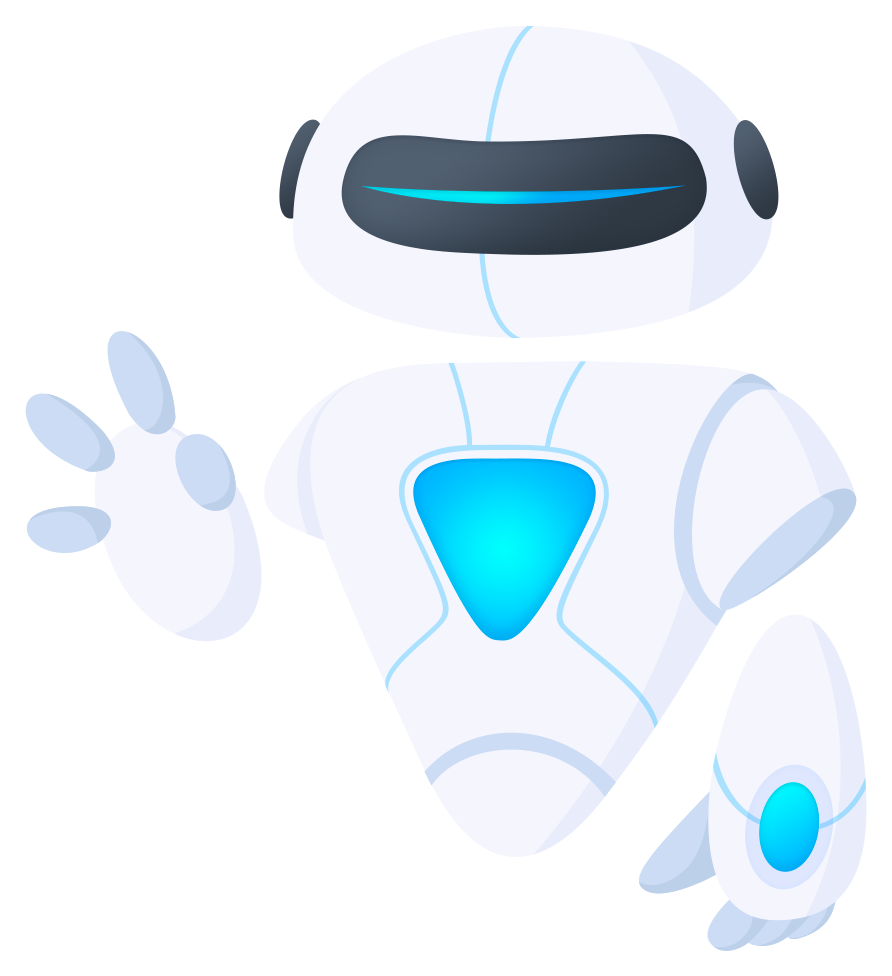

# Technologies I Work With

## 🚍 Communication

  
  
  

## 🧰 Version Control

  

## 🔨 Tools

  

## 🌐 Web Dev

  

## ✨ UI/UX

  

## 📜 JavaScript

  

## 🪒☕🐘 C#/Java/php

  
  

## 🐍 Python

  

## 📱 Mobile Dev

  
  

## 💾 Database

  

## 🤿 DevOps

  

## 🔬 Analytics

  

## 🧪 Testing

  
  

---

